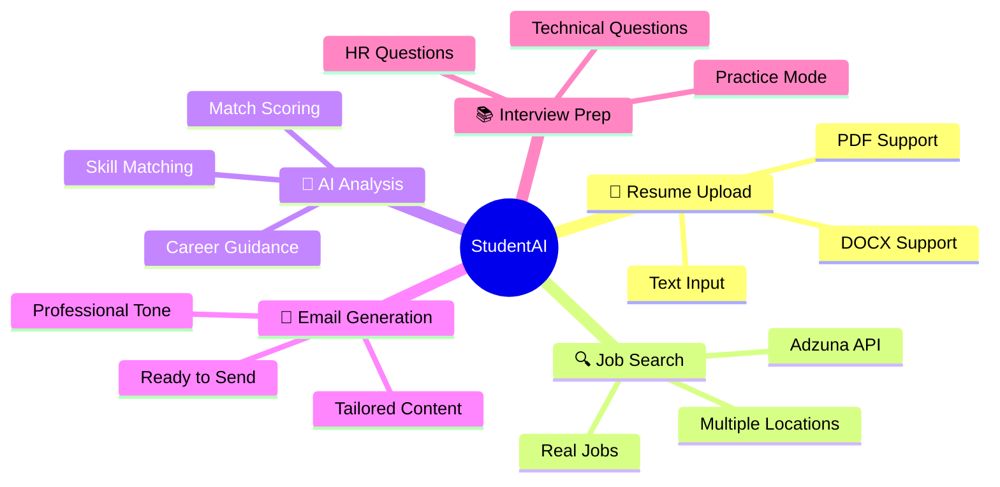
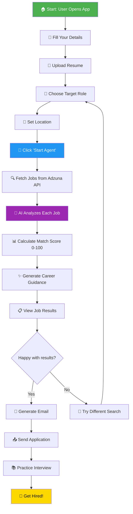
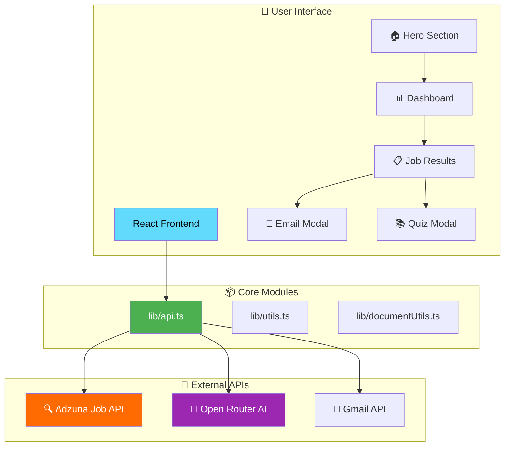
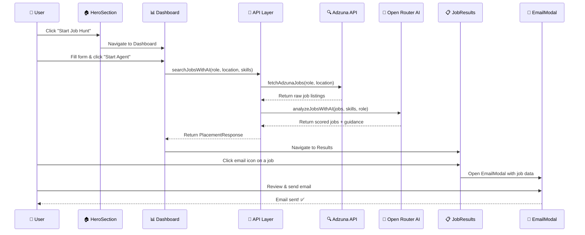
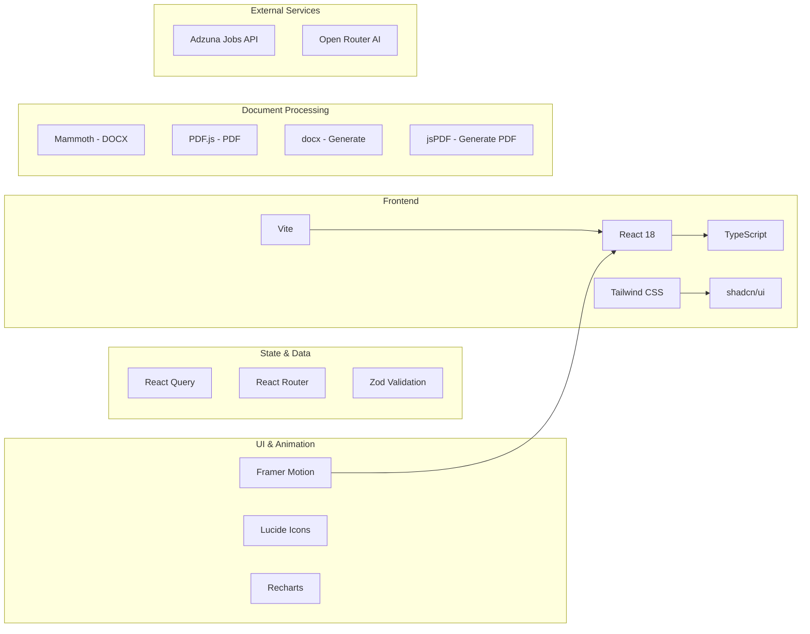
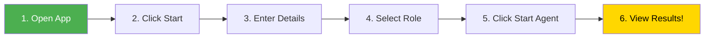
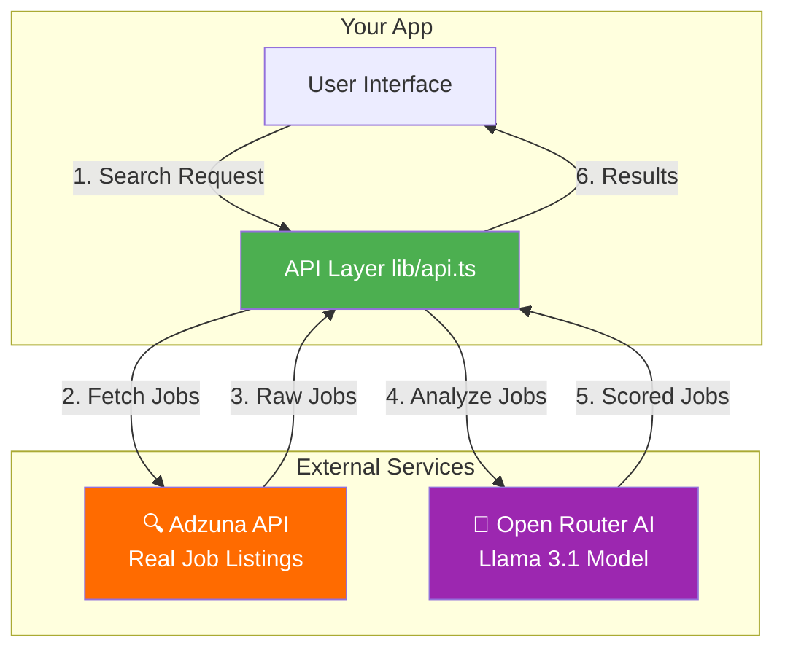
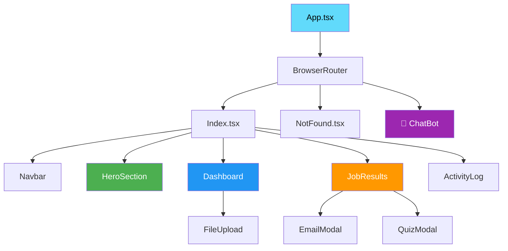

# 🎓 StudentAI Placement Agent

<div align="center">


**🚀 An AI-Powered Job Search Assistant That Finds, Scores, and Helps You Apply to Jobs Automatically**

[Features](#-features) • [How It Works](#-how-it-works) • [Installation](#-installation) • [Usage](#-usage) • [Architecture](#-architecture)

</div>

---

## 📖 What is StudentAI? (For Beginners!)

Imagine having a **smart robot friend** 🤖 that helps you find jobs! Here's what it does in simple terms:

1. **📝 You tell it about yourself** - Your name, skills, and what job you want
2. **🔍 It searches the internet** - Looking for jobs that match you
3. **🧠 AI thinks about each job** - Decides how good a match it is (score 0-100)
4. **📧 It writes emails for you** - Ready to send to companies
5. **📚 It helps you prepare** - For interviews with practice questions

> 💡 **Think of it like this**: It's like having a personal career assistant that works 24/7 and never gets tired!

---

## 🎯 Features



| Feature                | Description                        | Why It's Useful                    |
| ---------------------- | ---------------------------------- | ---------------------------------- |
| 📄 **Resume Upload**   | Upload PDF, DOCX, or paste text    | AI reads your skills automatically |
| 🔍 **Job Search**      | Searches real jobs from Adzuna API | Finds actual job listings          |
| 🧠 **AI Scoring**      | Scores each job 0-100              | Know which jobs are best for you   |
| 📧 **Email Drafts**    | Creates personalized emails        | Save time applying to jobs         |
| 📚 **Interview Prep**  | Generates Q&A for interviews       | Practice before the real thing     |
| 🎯 **Career Guidance** | AI advice for your career          | Get personalized tips              |
| 💬 **AI Chatbot**      | 24/7 chat assistant via n8n        | Get instant help anytime           |

---

## 🔄 How It Works

Here's the complete journey from "I want a job" to "I'm ready to apply":



### Step-by-Step Explanation:

| Step | What Happens              | Technical Detail                                 |
| ---- | ------------------------- | ------------------------------------------------ |
| 1️⃣   | **You enter your info**   | Name, email, skills, target role                 |
| 2️⃣   | **App searches for jobs** | Calls Adzuna API with your criteria              |
| 3️⃣   | **AI analyzes jobs**      | Uses Open Router AI (Llama 3.1) to score matches |
| 4️⃣   | **Results appear**        | Jobs sorted by match score                       |
| 5️⃣   | **You choose to apply**   | Generate email, practice interview               |

---

## 🏗️ Architecture

### System Architecture Diagram



### Component Flow Diagram



---

## 🛠️ Tech Stack



### Technology Explained (For Beginners!)

| Technology            | What It Is                                 | Why We Use It                       |
| --------------------- | ------------------------------------------ | ----------------------------------- |
| ⚛️ **React**          | A JavaScript library for building websites | Makes creating interactive UIs easy |
| 📘 **TypeScript**     | JavaScript with type safety                | Catches bugs before they happen     |
| ⚡ **Vite**           | A build tool                               | Makes development super fast        |
| 🎨 **Tailwind CSS**   | Utility-first CSS framework                | Style websites quickly              |
| 🧩 **shadcn/ui**      | Pre-built UI components                    | Beautiful buttons, forms, etc.      |
| 🔄 **React Query**    | Data fetching library                      | Handles API calls smoothly          |
| 🎬 **Framer Motion**  | Animation library                          | Makes things move beautifully       |
| 📄 **Mammoth/PDF.js** | Document readers                           | Read your resume files              |
| 🔍 **Adzuna API**     | Job search service                         | Finds real job listings             |
| 🧠 **Open Router AI** | AI service                                 | Analyzes and scores jobs            |

---

## 📁 Project Structure

```
studentai/
├── 📄 index.html              # Main HTML file
├── 📄 package.json            # Project dependencies
├── 📄 vite.config.ts          # Vite configuration
├── 📄 tailwind.config.ts      # Tailwind CSS config
├── 📄 tsconfig.json           # TypeScript config
│
├── 📂 public/                 # Static assets
│   ├── placeholder.svg
│   └── robots.txt
│
└── 📂 src/                    # Source code
    ├── 📄 App.tsx             # Main app component
    ├── 📄 main.tsx            # Entry point
    │
    ├── 📂 pages/              # Page components
    │   ├── Index.tsx          # Home page
    │   └── NotFound.tsx       # 404 page
    │
    ├── 📂 components/         # UI Components
    │   ├── HeroSection.tsx    # Landing hero
    │   ├── Dashboard.tsx      # Main dashboard
    │   ├── JobResults.tsx     # Job listings
    │   ├── EmailModal.tsx     # Email composer
    │   ├── QuizModal.tsx      # Interview prep
    │   ├── FileUpload.tsx     # Resume uploader
    │   ├── Navbar.tsx         # Navigation bar
    │   ├── ChatBot.tsx        # AI chat assistant
    │   └── ui/                # shadcn components
    │
    ├── 📂 lib/                # Utilities
    │   ├── api.ts             # API functions
    │   ├── utils.ts           # Helper functions
    │   └── documentUtils.ts   # Document processing
    │
    └── 📂 hooks/              # Custom React hooks
        ├── use-mobile.tsx
        └── use-toast.ts
```

---

## 🚀 Installation

### Prerequisites

Before you start, make sure you have these installed:

| Tool       | Version | Check Command    |
| ---------- | ------- | ---------------- |
| 📦 Node.js | 18+     | `node --version` |
| 📦 npm/bun | Latest  | `npm --version`  |

### Step 1: Clone the Repository

```bash
# Clone the project
git clone https://github.com/SairajMN/StudentAi.git

# Go into the project folder
cd StudentAi
```

### Step 2: Install Dependencies

```bash
# Using npm
npm install

# OR using bun (faster!)
bun install
```

### Step 3: Start the Development Server

```bash
# Using npm
npm run dev

# OR using bun
bun run dev
```

### Step 4: Open in Browser

🎉 **Success!** Open your browser and go to:

```
http://localhost:5173
```

---

## 📖 Usage Guide

### 🎬 Quick Start (5 Minutes!)



### Detailed Steps:

#### Step 1: 🏠 Landing Page

- Open the app at `http://localhost:5173`
- You'll see a beautiful hero section
- Click **"Start Job Hunt"** button

#### Step 2: 📊 Dashboard

Fill in your details:

| Field       | Example                       | Required?   |
| ----------- | ----------------------------- | ----------- |
| Full Name   | "John Doe"                    | Optional    |
| Email       | "john@email.com"              | Optional    |
| Skills      | "React, TypeScript, Node.js"  | Optional    |
| Resume      | Upload PDF/DOCX or paste text | Optional    |
| Target Role | Select from dropdown          | ✅ Required |
| Location    | "Bangalore" or "Remote"       | Optional    |

#### Step 3: 🚀 Start the Agent

- Click **"Start Agent"** button
- Watch the pipeline animate through steps:
  1. 🔍 Fetch Jobs
  2. 🧠 AI Analysis
  3. 📊 Score Match
  4. ✅ Done

#### Step 4: 📋 View Results

- See job cards with match scores
- Each card shows:
  - Job title & company
  - Location & salary
  - Match score (0-100)
  - Why it matched
  - Skills to highlight

#### Step 5: 📧 Apply to Jobs

- Click the **📧 email icon** on any job card
- Review the AI-generated email
- Click **"Open in Gmail"** to send

#### Step 6: 📚 Practice Interviews

- Click the **🧠 brain icon** on any job card
- Practice technical & HR questions
- Get ideal answers to study

---

## 🔌 API Integration

### Data Flow Diagram



### API Functions

| Function              | Purpose           | Input                  | Output          |
| --------------------- | ----------------- | ---------------------- | --------------- |
| `searchJobsWithAI()`  | Main job search   | role, location, skills | Jobs + Guidance |
| `fetchAdzunaJobs()`   | Fetch from Adzuna | role, location         | Raw jobs        |
| `analyzeJobsWithAI()` | AI scoring        | jobs, skills           | Scored jobs     |
| `sendEmailViaGmail()` | Send emails       | to, subject, body      | Success status  |

---

## 🎨 UI Components

### Component Hierarchy



### Key Components Explained:

| Component          | File              | Purpose                               |
| ------------------ | ----------------- | ------------------------------------- |
| 🏠 **HeroSection** | `HeroSection.tsx` | Landing page with animated background |
| 📊 **Dashboard**   | `Dashboard.tsx`   | Main form + pipeline visualization    |
| 📋 **JobResults**  | `JobResults.tsx`  | Display scored job cards              |
| 📧 **EmailModal**  | `EmailModal.tsx`  | Compose & send emails                 |
| 📚 **QuizModal**   | `QuizModal.tsx`   | Interview practice questions          |
| 📄 **FileUpload**  | `FileUpload.tsx`  | Drag & drop resume upload             |
| 💬 **ChatBot**     | `ChatBot.tsx`     | 24/7 AI chat assistant                |

---

## 🧪 Testing

```bash
# Run all tests
npm run test

# Run tests in watch mode
npm run test:watch

# Run E2E tests with Playwright
npx playwright test
```

---

## 📦 Build for Production

```bash
# Build the project
npm run build

# Preview the build
npm run preview
```

The built files will be in the `dist/` folder.

---

## 🤝 Contributing

We welcome contributions! Here's how:

1. 🍴 Fork the repository
2. 🌿 Create a feature branch: `git checkout -b feature/amazing-feature`
3. 💻 Make your changes
4. ✅ Run tests: `npm run test`
5. 📝 Commit: `git commit -m 'Add amazing feature'`
6. 🚀 Push: `git push origin feature/amazing-feature`
7. 🎉 Open a Pull Request

---

## 📄 License

This project is licensed under the MIT License - see the [LICENSE](LICENSE) file for details.

---

## 🙏 Acknowledgments

- 🎨 **shadcn/ui** - Beautiful UI components
- 🔍 **Adzuna** - Job search API
- 🧠 **Open Router** - AI model access
- ⚛️ **React Team** - Amazing framework
- 🎬 **Framer Motion** - Smooth animations
---

<div align="center">

### 🌟 Star this repo if you found it helpful!

**Built with ❤️ for students looking for their dream jobs**

[⬆ Back to Top](#-studentai-placement-agent)

</div>
